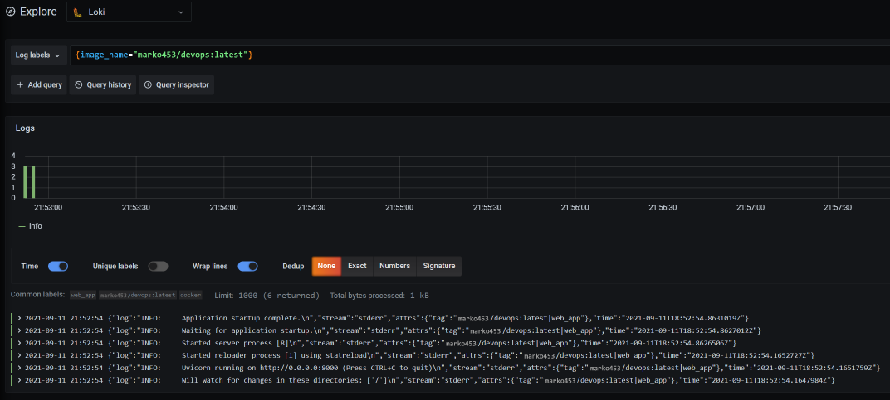
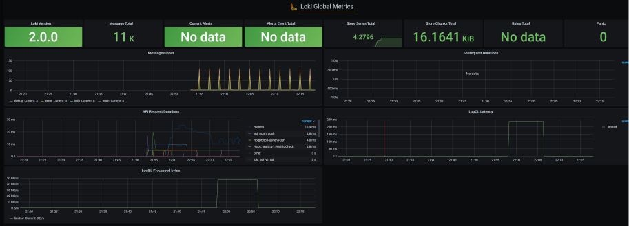
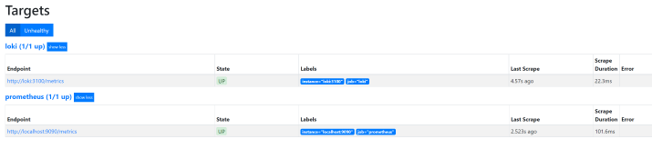

# Monitoring: Logging

## What have I used?

I have used stack:
- `Promtail`
- `Loki`
- `Grafana`

## Screenshots

We can see container by its own name or by image name (look at next two images).

## Metrics screenshots

Here are the images of working dashboards for Loki and Prometheus:

Here are shown services' logs:

## Best practices for Loki and Grafana

### Loki

- Use `chunk_target_size`. Use `-print-config-stderr` or `-log-config-reverse-order`.
- Rather use static labels instead of dynamic ones. Label values have to be bounded. Moreover, be aware of dynamic labels applied by clients.
- It is good practise to configure caching.

### Grafana

- As usual, documentation is important.
- Try to understand data sources because Grafana retrieves data from a data source.
- Try to find appropriate names for new dashboards (for example, use `test_`).
- Not forget to remove temporary experiment dashboards when you are done with them.
- Avoid unnecessary dashboard refreshing to reduce the load on the network or backend.
- Use left and right y-axes when displaying time series.
- Try to reuse your dashboards and enforce consistency by using templates and variables.
- Be careful with stacking graph data because visualizations can be misleading, and hide important data. We recommend turning it off in most cases.
- Use markdown to customize the display.